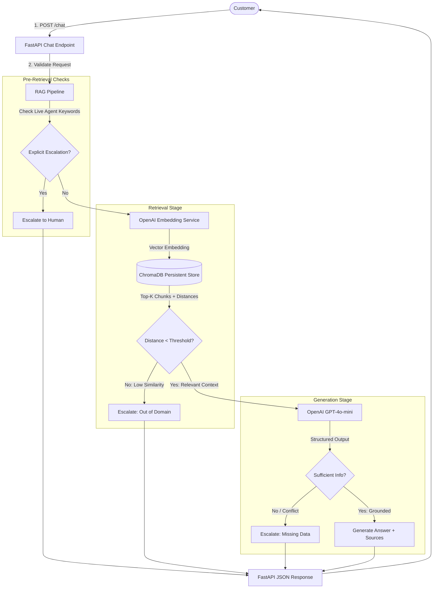

# 🤖 NovaTech AI Customer Support Agent (RAG + Human Escalation)

[](https://www.python.org/)
[](https://fastapi.tiangolo.com/)
[](https://openai.com/)
[](https://www.trychroma.com/)
[](LICENSE)

An enterprise-grade, production-ready AI Customer Support Agent built from scratch using **Retrieval-Augmented Generation (RAG)**, **ChromaDB**, **FastAPI**, and **OpenAI Structured Outputs**.

Designed without heavy black-box orchestrators (no LangChain/LlamaIndex) to demonstrate full architectural control over vector ingestion, similarity scoring, grounded response synthesis, citation tracking, and intelligent human escalation logic.

---

## 🌟 Key Features

- ⚡ **High-Performance FastAPI Backend**: Async REST endpoints with strict Pydantic v2 data validation and Swagger/OpenAPI documentation.
- 🔍 **Native RAG Architecture**: Direct integration with ChromaDB for dense vector retrieval and OpenAI `text-embedding-3-small` query embeddings.
- 🎯 **Grounded & Hallucination-Free**: Prompt design enforcing answers based *solely* on verified company documents with automated citation metadata (filename, page, snippets).
- 🛡️ **Intelligent Human Escalation**: Multi-tier escalation layer checking for low retrieval confidence (cosine distance threshold), ambiguous queries, missing information, and explicit human requests.
- 🔒 **Security & Prompt Injection Resistance**: System prompt isolation preventing adversarial user instructions from overriding core support policies.
- 💬 **Multi-Turn Conversation Support**: Accommodates dialogue history for context-aware customer interactions.
- 🧪 **Comprehensive Automated Test Suite**: Pytest coverage spanning endpoint validation, vector search, chunking, and escalation mechanisms.

---

## 📐 System Architecture



---

## 🗂️ Project Structure

```text
AI-Customer-Support-Agent/
│
├── app/
│   ├── __init__.py
│   ├── main.py                  # FastAPI application entrypoint & middleware
│   │
│   ├── api/
│   │   ├── __init__.py
│   │   └── routes.py            # API routes (/health, /chat, /knowledge-base/status)
│   │
│   ├── core/
│   │   ├── __init__.py
│   │   └── config.py            # Pydantic BaseSettings and environment configuration
│   │
│   ├── models/
│   │   ├── __init__.py
│   │   └── schemas.py           # Pydantic request, response, and structured output models
│   │
│   └── services/
│       ├── __init__.py
│       ├── llm.py               # OpenAI LLM client with structured output parsing
│       ├── embeddings.py        # OpenAI vector embedding generation
│       ├── ingestion.py         # Document parsing (.txt, .pdf), cleaning, and chunking
│       ├── retrieval.py         # ChromaDB persistence, upserting, and vector query
│       ├── rag.py               # Complete RAG coordinator pipeline
│       └── escalation.py        # Pre/post-retrieval human escalation engine
│
├── knowledge_base/              # Fictional NovaTech company knowledge base
│   ├── products/
│   │   └── nova_products.txt    # Product specs, batteries, ports, pricing
│   ├── policies/
│   │   ├── return_and_refund.txt # 30-day return policy, restocking fee, process
│   │   ├── warranty_policy.txt  # 1-year/2-year warranty details & exclusions
│   │   └── shipping_policy.txt  # Domestic & international shipping timelines
│   └── faq/
│       ├── payment_faq.txt      # Accepted payments, currencies, installments
│       └── troubleshooting_guide.txt # Reset steps, Bluetooth pairing, fan control
│
├── data/
│   └── chroma/                  # Local persisted Chroma vector database files
│
├── tests/
│   ├── __init__.py
│   ├── test_api.py              # API endpoint validation and mock response tests
│   ├── test_retrieval.py        # Chunking and vector search tests
│   ├── test_escalation.py       # Distance and trigger escalation tests
│   └── test_rag_evaluation.py   # RAG benchmark dataset and validation
│
├── scripts/
│   └── ingest_documents.py      # CLI script to chunk, embed, and index knowledge base
│
├── .env.example                 # Template environment variables
├── .env                         # Local environment configuration (git ignored)
├── .gitignore                   # Git ignore file
├── requirements.txt             # Project dependencies
└── README.md                    # Project documentation
```

---

## 🛠️ Tech Stack

| Technology | Purpose |
| :--- | :--- |
| **Python 3.10+** | Core programming language |
| **FastAPI** | High-performance asynchronous API framework |
| **Uvicorn** | ASGI web server |
| **OpenAI Python SDK (v1.20+)** | Embedding generation and LLM structured chat completion |
| **ChromaDB** | Local persistent vector database with Cosine similarity indexing |
| **Pydantic v2** | Strict data modeling, schema validation, and type safety |
| **python-dotenv** | Environment configuration management |
| **PyPDF** | PDF text extraction engine |
| **Pytest & HTTPX** | Automated testing and async endpoint verification |

---

## 🚀 Step-by-Step Setup Guide

### 1. Prerequisites
- Python 3.10 or higher installed:
  ```powershell
  python --version
  ```
- An active [OpenAI API Key](https://platform.openai.com/api-keys).

### 2. Clone & Navigate to Project Directory
```powershell
git clone https://github.com/your-username/AI-Customer-Support-Agent.git
cd AI-Customer-Support-Agent
```

### 3. Create & Activate Virtual Environment
**On Windows (PowerShell):**
```powershell
python -m venv .venv
.venv\Scripts\Activate.ps1
```

*(If you encounter execution policy restrictions on PowerShell, run: `Set-ExecutionPolicy -ExecutionPolicy RemoteSigned -Scope Process`)*

**On macOS / Linux:**
```bash
python3 -m venv .venv
source .venv/bin/activate
```

### 4. Install Dependencies
```powershell
pip install --upgrade pip
pip install -r requirements.txt
```

### 5. Configure Environment Variables
Copy `.env.example` to `.env` and enter your OpenAI API key:
```powershell
cp .env.example .env
```
Edit `.env`:
```env
OPENAI_API_KEY=sk-proj-yourActualOpenAIApiKeyHere
OPENAI_MODEL=gpt-4o-mini
EMBEDDING_MODEL=text-embedding-3-small
CHROMA_PERSIST_DIRECTORY=data/chroma
CHROMA_COLLECTION_NAME=novatech_knowledge_base
TOP_K=4
SIMILARITY_DISTANCE_THRESHOLD=0.65
CHUNK_SIZE=500
CHUNK_OVERLAP=100
API_HOST=127.0.0.1
API_PORT=8000
```

---

## 📥 Ingesting the Knowledge Base

Before querying the agent, populate the vector database with the company documents:

```powershell
python scripts/ingest_documents.py
```

To re-index or wipe the existing vector store:
```powershell
python scripts/ingest_documents.py --reset
```

**Expected Output:**
```text
============================================================
🚀 NOVATECH KNOWLEDGE BASE INGESTION PIPELINE
============================================================
📁 Knowledge Base Path: ...\knowledge_base
📊 Target Chroma Collection: novatech_knowledge_base
⚙️ Chunk Size: 500 | Overlap: 100
🧠 Embedding Model: text-embedding-3-small
------------------------------------------------------------
⏳ Scanning and chunking documents...
✅ Created 28 text chunks from documents.
⏳ Generating vector embeddings via OpenAI API...
⏳ Upserting chunks and embeddings into ChromaDB...
------------------------------------------------------------
🎉 INGESTION COMPLETE! Indexed 28 chunks in 1.45 seconds.
📦 Total chunks now in ChromaDB: 28
============================================================
```

---

## 💻 Running the FastAPI Server

Start the application with Uvicorn:

```powershell
uvicorn app.main:app --reload --host 127.0.0.1 --port 8000
```

- **Interactive Swagger API Docs**: [http://127.0.0.1:8000/docs](http://127.0.0.1:8000/docs)
- **ReDoc Alternative Docs**: [http://127.0.0.1:8000/redoc](http://127.0.0.1:8000/redoc)

---

## 📡 API Endpoints & Examples

### 1. Health Check
`GET /health`

**Example Request:**
```powershell
curl -X GET http://127.0.0.1:8000/health
```
**Response:**
```json
{
  "status": "ok",
  "service": "NovaTech AI Customer Support Agent",
  "version": "1.0.0"
}
```

---

### 2. Customer Support Chat
`POST /chat`

#### Scenario A: Grounded Answer with Source Citations
**Request:**
```json
{
  "message": "What is your return policy for opened items?"
}
```
**Response:**
```json
{
  "answer": "Opened, non-defective items in working condition can be returned within the 30-day return window, but they are subject to a 10% restocking fee to cover inspection and repackaging. Items must include all original packaging and accessories.",
  "needs_escalation": false,
  "reason": null,
  "sources": [
    {
      "document": "return_and_refund.txt",
      "category": "policies",
      "page": 1,
      "snippet": "Opened, non-defective items in working condition: Subject to a 10% restocking fee to cover inspection and repackaging..."
    }
  ]
}
```

---

#### Scenario B: Out-of-Domain Query (Automatic Escalation)
**Request:**
```json
{
  "message": "Do you sell commercial airline jet engines?"
}
```
**Response:**
```json
{
  "answer": "I don't have enough verified company information to answer that accurately. I have flagged this inquiry for a NovaTech customer support specialist who will assist you shortly.",
  "needs_escalation": true,
  "reason": "Retrieved knowledge base content is not sufficiently relevant (cosine distance: 0.812 > 0.65).",
  "sources": []
}
```

---

#### Scenario C: Multi-Turn Conversation
**Request:**
```json
{
  "message": "What about the battery?",
  "conversation_history": [
    {"role": "user", "content": "What is the warranty for the NovaSound ANC headphones?"},
    {"role": "assistant", "content": "The NovaSound ANC Elite headphones come with a 2-Year Limited Manufacturer Warranty."}
  ]
}
```
**Response:**
```json
{
  "answer": "Internal rechargeable lithium-ion batteries are covered under warranty for 1 year from the date of original purchase, provided their maximum charging capacity drops below 80% under standard use.",
  "needs_escalation": false,
  "reason": null,
  "sources": [
    {
      "document": "warranty_policy.txt",
      "category": "policies",
      "page": 1,
      "snippet": "Rechargeable Battery Warranty: Internal rechargeable lithium-ion batteries are warranted for a period of 1 Year..."
    }
  ]
}
```

---

## 🧪 Running Automated Tests

Run the complete test suite:

```powershell
pytest -v
```

**Expected Output:**
```text
tests/test_api.py::test_health_check PASSED
tests/test_api.py::test_chat_empty_message_validation PASSED
tests/test_api.py::test_chat_missing_message_field PASSED
tests/test_api.py::test_chat_successful_response PASSED
tests/test_api.py::test_chat_escalated_response PASSED
tests/test_retrieval.py::test_chunking_logic PASSED
tests/test_retrieval.py::test_chroma_upsert_and_query PASSED
tests/test_escalation.py::test_pre_retrieval_human_trigger PASSED
tests/test_escalation.py::test_distance_threshold_escalation PASSED
tests/test_escalation.py::test_build_escalation_response PASSED
tests/test_rag_evaluation.py::test_evaluation_dataset_structure PASSED

======================== 11 passed in 1.82s ========================
```

---

## 🔒 Security & Guardrails

1. **Environment Secrets**: API keys are loaded strictly via `.env` and `.gitignore` prevents credential leaks.
2. **Prompt Injection Hardening**: Context delimiters separate user input and retrieved knowledge chunks. The system prompt instructs the model to treat retrieved documents exclusively as reference data.
3. **Data Sanitization**: Pydantic v2 rejects empty or whitespace payloads and caps maximum query length (2,000 characters) to prevent token abuse.
4. **Error Masking**: Production exception handlers prevent raw database/stack traces from leaking to client endpoints.

---

## 🔮 Limitations & Future Roadmap

- [ ] **Live Helpdesk Integrations**: Forward escalated tickets directly into Zendesk, Freshdesk, or Jira Service Management.
- [ ] **Hybrid Search**: Combine BM25 sparse keyword retrieval with Chroma dense embeddings (Reciprocal Rank Fusion).
- [ ] **Voice / Real-time WebSockets**: Add speech-to-text / text-to-speech for real-time customer voice assistance.
- [ ] **User Feedback Logging**: Log 👍/👎 rating telemetry to optimize retrieval threshold parameters over time.

---

## 📄 License
This project is open-source under the [MIT License](LICENSE).
